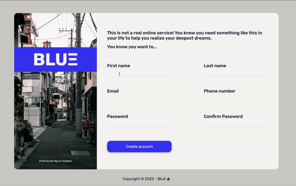

# Sign Up Form #

100% mobile responsive sign-up form.
[Live Demo](https://blu3tan.github.io/Sign-up-form)

# Description #

All the stiles for the inputs different states are achieved via CSS pseudo-classes and pseudo-elements combinations

The input validation and the error messages are handled with HTML and CSS except for the password comparison that uses Javascript.

-----------------------------------------------------------------------------